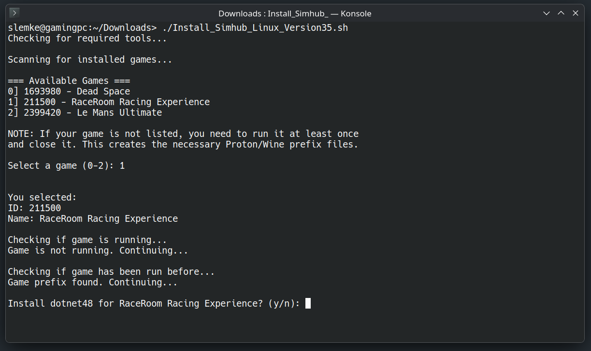
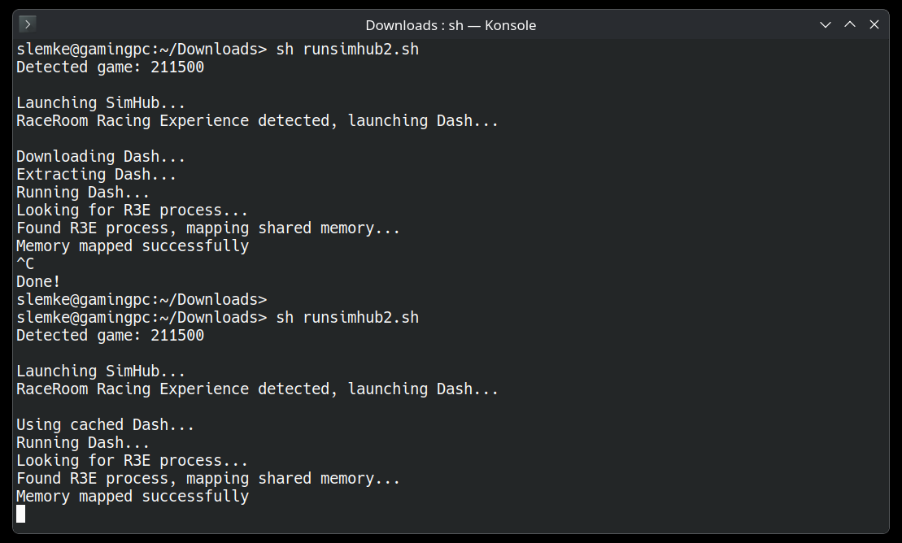

A bash script to install SimHub and dotnet48 for Steam games running under Proton/Wine.
Works for all games.
You never have to run any of this as root. Do not run as root, this is Linux :)



## Requirements, those are automatically checked:

- `protontricks`
- `winetricks`
- `wget` or `curl`
- `unzip`

## Features:

- `Scans installed Steam games`
- `Checks if game has been run before to confirm a populated game vessel exists`
- `Installs dotnet48 (user has to confirm)`
- `Downloads and installs SimHub 9.11.5`
- `Gives instructions on what SimHub components to install`
- `Sets Windows version to Windows 11 for better SimHub compatibility`
- `Provides installation time tracking for dotnet48`

## How to Install:
```bash
wget https://github.com/srlemke/SimHub_on_Linux/blob/main/Install_Simhub_Linux.sh
chmod +x Install_Simhub_Linux.sh
./Install_Simhub_Linux.sh
```

## How to run:
```bash
wget https://github.com/srlemke/SimHub_on_Linux/blob/main/runsimhub2.sh
chmod +x runsimhub2.sh
./runsimhub2.sh
```
- You probably can add this command to a menu laucher with icon.

## Running:


