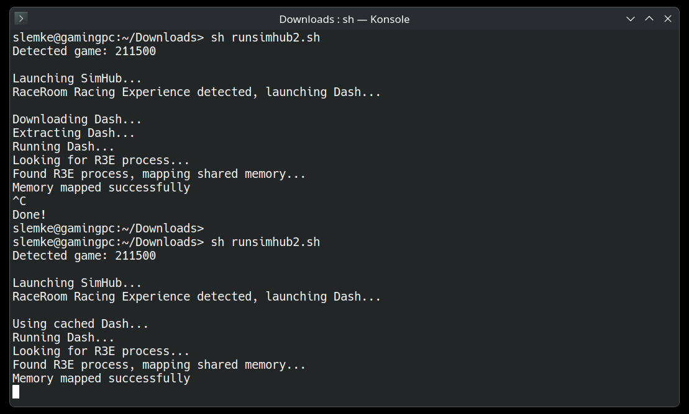

🚀 A shell script to install and run [SimHub](https://www.simhubdash.com/), [CrewChief](https://thecrewchief.org/) and its dotnet48 dependency.  
💡 Offers to install [Proton-GE](https://github.com/GloriousEggroll/proton-ge-custom/releases/tag/GE-Proton10-34) and [Custom LMU Proton‑GE](https://github.com/JacKeTUs/proton-ge-custom/releases) if not present.  
📦 I recommend [Proton-GE](https://github.com/GloriousEggroll/proton-ge-custom/releases/tag/GE-Proton10-34) for it's .NET compatibility.  
🐧 You never have to run any command as root. Do not run as root, this is Linux :)  


## Requirements, those are automatically checked:

- `protontricks`
- `wget` or `curl`
- `unzip`

## Features:

- `Scans installed Steam games`
- `Can Install dotnet48`
- `Can Install SimHub and CrewChief`
- `Gives instructions on what SimHub components to install`
- `Detects Proton version per game, even if a custom Proton (eg. LMU)`
- `Can install LMU custom Proton (Required for LMU) or Proton GE (Recommended)`
- `Automatically adds plugins and configures LMU`
- `Automatically adds dash.exe for RaceRomm SealHUD usage`

## How to Install && run. Copy Pasta should work:
```bash
git clone https://github.com/srlemke/SimHub_on_Linux.git
cd SimHub_on_Linux/
chmod +x *.sh

#To Install and run SimHUB:
./Install_Simhub_Linux.sh
./runsimhub2.sh

#To Install and run CrewChief:
./Install_CrewChief_Linux.sh
./runcrewchief.sh
```
Other Usage options:
```bash
#List installed games and respective ID
./runsimhub2.sh -l
./runcrewchief.sh -l

#Run SimHUB/CrewChief for the game without starting the game - This examples uses LMU ID
./runsimhub2.sh 2399420 
./runcrewchief.sh 2399420 
```

- You probably can add runsimhub2.sh command to a menu laucher with icon.
- You probably can add runcrewchief.sh command to a menu laucher with icon.


## Running:


Some details:
It works but you have to install dotnet48 and SimHUB for every game prefix.
So if you have 5 race games installed, you have to install dotnet48 and SimHUB 5 times each.
There is not really so many simulators, at least for me its no big deal, as long as it works.

There is a few other options out there that bridge the shared memory from the proton prefix to
other prefixes, I tried it but it was not super easy, this script in the end does not rely on
any additional software thats not packaged on distros which makes it usually more streamlined.
